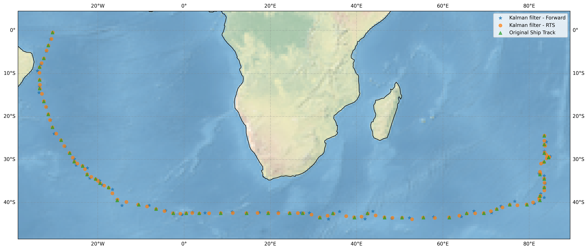

# Estimators of Ship Tracks

#### Kalman filters

This Python library implements an Unscented Kalman Filter with geodetic dynamics, as described in references [1] and [2]. Furthermore, it includes the implementation of the Unscented Rauch-Tung-Striebel Smoother (URTSS) algorithm, elaborated in reference [3]. The implemented outlier robustification method is detailed in reference [4].

#### Gausian Processes

This library leverages the functionalities of Gaussian process models available in scikit-learn [5]. Users can leverage all features of Gaussian process models seamlessly through this toolkit.

## Conda environment

To utilise this package, it should be installed within a dedicated Conda environment. You can create this environment using the following command:

```bash
conda env create -n shiptrack-estimators -f environment.yml
```

To activate the conda environment use:

```bash
conda activate shiptrack-estimators
```

## Install the package

To install this library, follow these steps:

### Cloning the repository

Begin by cloning this repository using the following command:

```bash
git clone git@github.com:NOC-OI/ship-track-estimators.git
```

### Pip installation

Once the repository is cloned, navigate to the root directory of the package and execute the following command:

```bash
pip install -e .
```

If you prefer to install the package directly from the repository without cloning it, use the following command:

```
pip install git+https://github.com/NOC-OI/ship-track-estimators.git@main#egg=track_estimators
```

### Installation using `setup.py`

Alternatively, if you wish to install using the `setup.py` script, after cloning the repository, navigate to the root directory of the package and execute the following command:

```
python setup.py install
```

## Examples

## Python Scripts

Numerous examples of Python scripts explaining how to use this package can be found in the examples directory.

### Command line interface (CLI)

The CLI provided by this package allows you to execute the Unscented Kalman Filter; however, it offers less flexibility compared to using the Python scripts. To run the track estimator in the terminal, type, e.g., the following command:

```bash
track_estimator -i input.json -o "output" -t  data/historical_ships/historical_ship_data.csv -s 01203823 -ic "primary.id" -lat "lat" -lon "lon" -rts
```

#### Flags description

- `-i` or `--input`: Filepath to the input JSON file containing the Unscented Kalman Filter configurations (by default `input.json`)
- `-o` or `--output`: Output file prefix (by default `output`)
- `-t` or `--track-file`: Filepath to the ship track data (mandatory)
- `-s` or `--ship-id`: ID of the ship (mandatory)
- `-lat` or `--latitude-id`: Name of the latitude column (mandatory)
- `-lon` or `--longitude-id`: Name of the longitude column (mandatory)
- `-ic` or `--id-col`: Name of the ship ID column (mandatory)
- `-rts` or `--rts-smoother`: Apply the Rauch-Tung-Striebel (RTS) smoother
- `-rev` or `--reverse`: Reverse the track

#### Example of `input.json`

```json
{
  "dim": 4,
  "H": [1, 1, 0, 0],
  "R": [0.0025, 0.0025, 0, 0],
  "Q": [1e-4, 1e-4, 1e-6, 1e-6],
  "P": [1.0, 1.0, 1.0, 1.0],
  "dt": 1,
  "nsteps": 500,
}
```

Here, `dim` represents the dimensions of matrices, `H` is the measurement matrix, `R` is the measurement noise covariance matrix, `Q` the process noise covariance, and `P` is the estimate error covariance matrix. Furthermore, `dt` is the time step (which can be either a constant time step or a list of numbers), and `nsteps` indicates the number of estimation steps to be performed. When `dt` is `-1`, `0` or `null`, the `nsteps` parameter indicates the number of sub-steps that should be performed within each main time step, as determined by the measurements. For example:

```json
{
  "dim": 4,
  "H": [1, 1, 0, 0],
  "R": [0.001, 0.001, 0, 0],
  "Q": [1e-2, 1e-2, 1e-4, 1e-4],
  "P": [1.0, 1.0, 1.0, 1.0],
  "dt": -1,
  "nsteps": 2
}
```

This configuration will result in performing 2 sub-steps within each main step, with the length of each main step determined by the measurement data.
It produces the following results:



The speed over ground (SOG) and course over ground (COG) can also be smoothed prior to calculating their respective rates using the smooth parameter, which determines the number of data points to be used for the moving average.

```json
{
  "dim": 4,
  "H": [1, 1, 0, 0],
  "R": [0.01, 0.01, 0, 0],
  "Q": [1e-4, 1e-4, 1e-6, 1e-6],
  "P": [1.0, 1.0, 1.0, 1.0],
  "dt": -1,
  "nsteps": 2,
  "smooth": 2
}
```

## References

1. [Unscented Kalman filter for long-distance vessel tracking in geodetic coordinates][1]
1. [Unscented Filtering and Nonlinear Estimation][2]
1. [Unscented Rauch-Tung-Striebel Smoother][3]
1. [Robust Kalman filtering based on Mahalanobis distance as outlier judging criterion][4]
1. [scikit-learn: Gaussian Processes][5]

[1]: https://doi.org/10.1016/j.apor.2022.103205
[2]: https://ieeexplore.ieee.org/document/1271397
[3]: http://ieeexplore.ieee.org/document/4484208/
[4]: https://link.springer.com/article/10.1007/s00190-013-0690-8
[5]: https://scikit-learn.org/stable/modules/gaussian_process.html
